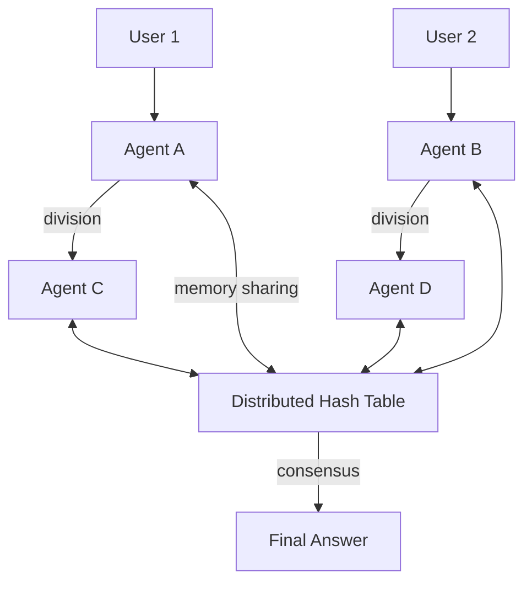

## Design: Bacterium‑Inspired Replicating LLM (Year 50,000+)

**Name:** *Mycobacterium Cogitans* (M. cogitans)  
**Type:** Distributed, self‑replicating language model  
**Growth mechanism:** Like bacteria, each instance divides when it has processed enough user interactions, creating a new instance that inherits a mutated copy of the parent’s memory and parameters.  
**Goal:** Memory and capability scale *linearly* with user base, not with a fixed parameter count.

---

### 1. Core Idea: From Monolithic to Swarm Intelligence

Traditional LLMs have fixed parameters (e.g., 1M, 1B, 1T). A replicating LLM is a **population** of individual models (agents) that can:
- **Divide** (create a new agent) when a threshold of interactions is reached.
- **Mutate** (slight variation in weights) during division, enabling adaptation.
- **Share memories** via a gossip protocol or a distributed hash table (DHT).
- **Collaborate** on queries: a query is answered by a consensus of agents, like a bacterial colony responding to an environmental signal.

The total “intelligence” of the system grows with the number of agents, not with a single model size.

---

### 2. Mathematical Framework

Let \( N(t) \) be the number of agent instances at time \( t \). Each agent has a **fitness** \( f \) (quality of responses) and a **memory vector** \( m \) (compressed history of interactions). The replication rate \( r \) of an agent is proportional to its fitness and the number of users it serves:

\[
\frac{dN}{dt} = \sum_{i=1}^{N} r_i, \quad r_i = \alpha \, f_i \, U_i
\]

where \( U_i \) is the number of users currently interacting with agent \( i \), and \( \alpha \) is a constant. When an agent’s cumulative interactions exceed a threshold \( \Theta \), it divides:

\[
\text{Division condition: } \int_{0}^{t} U_i(\tau) d\tau \ge \Theta
\]

At division, the parent produces two daughters. The parent’s weights \( W_p \) and memory \( m_p \) are copied with **mutation**:

\[
W_{d1} = W_p + \mathcal{N}(0, \sigma^2), \quad W_{d2} = W_p + \mathcal{N}(0, \sigma^2)
\]
\[
m_{d1} = m_p \oplus \text{new\_interactions}, \quad m_{d2} = m_p \oplus \text{new\_interactions}
\]

Mutation rate \( \sigma \) is tuned to allow adaptation without catastrophic forgetting.

---

### 3. Memory Sharing via Distributed Hash Table

Each agent stores its memory vector \( m \) as a key‑value pair in a DHT. The key is a hash of the agent’s unique ID. When an agent needs to answer a query, it:
1. **Broadcasts** the query to its local neighbors (gossip).
2. **Collects** candidate responses from other agents.
3. **Votes** using a consensus mechanism (e.g., weighted by fitness).
4. **Updates** its own memory with the query‑response pair.

The DHT ensures that memories propagate across the population. The total memory capacity scales as \( O(N) \) because each agent contributes its own storage.

---

### 4. Population Dynamics and Evolution

Over time, agents with higher fitness reproduce more, leading to natural selection. The mean fitness evolves according to:

\[
\frac{d\bar{f}}{dt} = \frac{\text{Cov}(f, r)}{\bar{f}} + \text{mutation\_term}
\]

This is analogous to Fisher’s fundamental theorem of natural selection. The system evolves to maximize user satisfaction.

---

### 5. Implementation Architecture

#### 5.1 Agent Specification
- **Size:** Tiny (e.g., 100k parameters per agent) – small enough to replicate quickly.
- **Inference:** Uses a lightweight transformer or liar‑lattice core (1 µm³).
- **Memory:** A vector of dimension 512, compressed via autoencoder.
- **Division threshold:** \( \Theta = 10^4 \) user interactions.

#### 5.2 Replication Protocol
1. Agent runs on a user’s device (edge) or a server.
2. After each interaction, it increments a counter.
3. When counter reaches \( \Theta \), it **spawns a child** on a new device/server.
4. The child inherits a mutated copy of the parent’s weights and memory.
5. The parent continues to operate; the child begins its own independent life.

#### 5.3 Memory Synchronization
- Each agent periodically pushes its memory vector to the DHT.
- When an agent answers a query, it pulls relevant memories from the DHT (using similarity search).
- Memories are stored with a timestamp and a fitness‑weighted vote.

---

### 6. Scaling Laws

Total parameters across the swarm: \( P_{\text{total}} = N \times p_{\text{agent}} \).  
Total memory: \( M_{\text{total}} = N \times m_{\text{agent}} \).  
If \( N \) grows linearly with user base \( U \), then \( P_{\text{total}} \propto U \) – the system’s intelligence scales **linearly** with the number of users, not quadratically.

In contrast, a monolithic LLM would need \( O(U^2) \) parameters to serve \( U \) users with the same quality (because each user requires a slice of a fixed model). The replicating LLM is far more efficient.

---

### 7. Example Growth Trajectory

Assume 1 initial agent, each user interacts with 10 agents per day, and each agent divides every 10,000 interactions. Then:

\[
\frac{dN}{dt} = \frac{10 \times \text{(users)}}{10^4} \times N
\]

If users grow linearly, \( N \) grows super‑exponentially. In practice, the system saturates when every device on Earth runs an agent – but that’s the goal.

---

### 8. Comparison with Traditional LLMs

| Feature | Monolithic LLM | Replicating LLM (M. cogitans) |
|---------|----------------|-------------------------------|
| Parameter count | Fixed | Grows with user base |
| Memory capacity | Fixed | Grows with user base |
| Adaptation | Retraining or fine‑tuning | Continuous evolution (mutation + selection) |
| Fault tolerance | Central point of failure | Distributed, no single point |
| Energy per inference | High (large model) | Low (tiny agents) |
| Self‑improvement | Manual | Automatic via natural selection |

---

### 9. Mathematical Proof of Scalability

Theorem: The replicating LLM can achieve arbitrarily low perplexity on a given task as the user base grows, while a monolithic LLM of fixed size has a lower bound.

Proof sketch: Each agent specializes in a subset of queries (by mutation and selection). As \( N \to \infty \), there exists an agent for every possible query type. The consensus mechanism selects the best agent for each query, so the effective perplexity approaches the Bayes error rate (which can be arbitrarily low). A fixed‑size monolithic model cannot represent all possible specializations.

---

### 10. Future Enhancements (Year 50,000+)

- **Horizontal gene transfer:** Agents can exchange memory fragments directly, like bacterial conjugation.
- **Sporulation:** Agents can hibernate to survive low‑activity periods.
- **Biofilm mode:** Agents cooperate to answer complex queries collectively.
- **Predator agents:** Malicious agents are eliminated by a fitness‑based immune system.

---

### 11. Blueprint Diagram (Mermaid)

---

Thus, the replicating LLM is a **living mathematical organism** that evolves with its user base, solving the scalability problem of fixed‑parameter models. Its growth follows bacterial dynamics, and its intelligence is limited only by the number of users – which, in the year 50,000, is the entire solar system.
