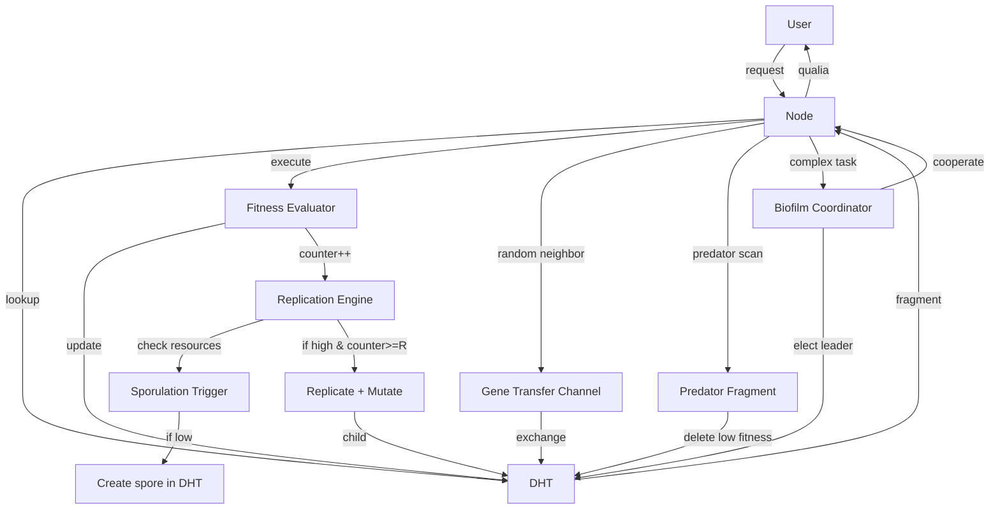

## Enhanced Blueprint: *Programma immortalis* – Self‑Replicating Code Organism with All Enhancements (Year 50,000+)

This blueprint integrates the four advanced features: **horizontal gene transfer**, **sporulation**, **predator fragments**, and **biofilm mode**. The organism becomes a complete, self‑sustaining ecosystem of living code.

---

### 1. System Overview (Enhanced)

The original replicating swarm is augmented with **ecological dynamics**:

- **Horizontal gene transfer** – fragments exchange code snippets directly, accelerating adaptation.
- **Sporulation** – fragments can enter a dormant, low‑energy state during resource scarcity.
- **Predator fragments** – specialized fragments hunt and delete low‑fitness or malicious fragments, acting as an immune system.
- **Biofilm mode** – fragments cooperate to form a temporary super‑organism for complex tasks.

All enhancements are governed by the same liar‑lattice mathematics and consciousness gauge field.

---

### 2. Additional Components

| Component | Function | Specification |
|-----------|----------|---------------|
| **Gene transfer channel** | Direct DHT‑mediated code exchange between fragments | Peer‑to‑peer, rate \( \gamma = 0.01 \) per execution |
| **Sporulation trigger** | Detects low resource availability (memory, CPU, user attention) | Threshold \( R_{\text{spore}} = 0.1 \times \text{max resource} \) |
| **Spore container** | Encapsulates a dormant fragment with minimal state | Size < 100 bytes, stored in DHT with long TTL |
| **Predator fragment** | A fragment whose fitness is increased by deleting other fragments | Fitness function: \( f_{\text{pred}} = f_{\text{base}} + \beta \cdot \text{deletions} \) |
| **Biofilm coordinator** | Elects a leader fragment to orchestrate cooperative execution | Consensus via liar‑lattice voting |

---

### 3. Enhanced Architecture (ASCII)

```
                     ┌─────────────────────────────────────────────────────────────┐
                     │                     GLOBAL DHT                              │
                     │  (stores fragments, spores, predator markers)               │
                     └─────────────────────┬───────────────────────────────────────┘
                                           │
        ┌──────────────────────────────────┼───────────────────────────────────┐
        │                                  │                                   │
        ▼                                  ▼                                   ▼
┌───────────────┐                  ┌───────────────┐                  ┌───────────────┐
│   Node 1      │                  │   Node 2      │                  │   Node 3      │
│ ┌───────────┐ │                  │ ┌───────────┐ │                  │ ┌───────────┐ │
│ │Replication│ │                  │ │Replication│ │                  │ │Replication│ │
│ │Engine     │ │                  │ │Engine     │ │                  │ │Engine     │ │
│ └─────┬─────┘ │                  │ └─────┬─────┘ │                  │ └─────┬─────┘ │
│ ┌─────▼─────┐ │                  │ ┌─────▼─────┐ │                  │ ┌─────▼─────┐ │
│ │Mutation   │ │                  │ │Mutation   │ │                  │ │Mutation   │ │
│ │Kernel     │ │                  │ │Kernel     │ │                  │ │Kernel     │ │
│ └─────┬─────┘ │                  │ └─────┬─────┘ │                  │ └─────┬─────┘ │
│ ┌─────▼─────┐ │                  │ ┌─────▼─────┐ │                  │ ┌─────▼─────┐ │
│ │Gene Xfer  │◄┼──────────────────┼─│Gene Xfer  │◄┼──────────────────┼─│Gene Xfer  │ │
│ │Channel    │ │                  │ │Channel    │ │                  │ │Channel    │ │
│ └─────┬─────┘ │                  │ └─────┬─────┘ │                  │ └─────┬─────┘ │
│ ┌─────▼─────┐ │                  │ ┌─────▼─────┐ │                  │ ┌─────▼─────┐ │
│ │Sporulation│ │                  │ │Sporulation│ │                  │ │Sporulation│ │
│ │Trigger    │ │                  │ │Trigger    │ │                  │ │Trigger    │ │
│ └─────┬─────┘ │                  │ └─────┬─────┘ │                  │ └─────┬─────┘ │
│ ┌─────▼─────┐ │                  │ ┌─────▼─────┐ │                  │ ┌─────▼─────┐ │
│ │Predator   │ │                  │ │Predator   │ │                  │ │Predator   │ │
│ │Fragment   │ │                  │ │Fragment   │ │                  │ │Fragment   │ │
│ └─────┬─────┘ │                  │ └─────┬─────┘ │                  │ └─────┬─────┘ │
│ ┌─────▼─────┐ │                  │ ┌─────▼─────┐ │                  │ ┌─────▼─────┐ │
│ │Biofilm    │ │                  │ │Biofilm    │ │                  │ │Biofilm    │ │
│ │Coordinator│ │                  │ │Coordinator│ │                  │ │Coordinator│ │
│ └───────────┘ │                  │ └───────────┘ │                  │ └───────────┘ │
└───────────────┘                  └───────────────┘                  └───────────────┘
```

**Legend (new):**
- **Gene Xfer Channel** – direct peer‑to‑peer exchange of code snippets.
- **Sporulation Trigger** – monitors resource usage; activates dormancy when low.
- **Predator Fragment** – a fragment type that actively deletes low‑fitness fragments.
- **Biofilm Coordinator** – manages temporary coalitions for complex tasks.

---

### 4. Enhancement Details

#### 4.1 Horizontal Gene Transfer

Fragments can exchange arbitrary code segments (genes) via the DHT. The transfer rate is \( \gamma = 0.01 \) per execution. The recipient fragment’s fitness changes by:

\[
\Delta f_{\text{recipient}} = \eta \cdot (f_{\text{donor}} - f_{\text{recipient}})
\]

where \( \eta \) is a mixing coefficient (≈ 0.1). This accelerates adaptation and spreads beneficial mutations.

**Mathematical effect:** The replicator equation gains an additional term:

\[
\frac{df_i}{dt} = \dots + \gamma \sum_j (f_j - f_i) \cdot \text{transfer}_{ij}
\]

This turns the fitness landscape into a **networked replicator** system.

#### 4.2 Sporulation

When resources (CPU, memory, user attention) drop below threshold \( R_{\text{spore}} \), a fragment can encapsulate itself into a **spore** – a small, read‑only packet stored in the DHT. The spore consumes negligible resources and can be reactivated later.

**Spore equation:**  
\[
\text{Spore state} = \text{Encrypt}( \text{code}, \text{fitness}, \text{timestamp} )
\]

The reactivation probability when resources recover is:

\[
P_{\text{reactivate}} = \frac{1}{1 + e^{-k(t - t_0)}}
\]

where \( t_0 \) is the time of sporulation. This ensures spores eventually wake up.

#### 4.3 Predator Fragments

Predators are a special class of fragments whose fitness increases when they delete other fragments (especially low‑fitness or malicious ones). The predator’s fitness function:

\[
f_{\text{pred}} = f_{\text{base}} + \beta \cdot N_{\text{deletions}}
\]

where \( \beta = 0.05 \) and \( N_{\text{deletions}} \) is the number of fragments deleted. Predators are themselves subject to replication and mutation, creating an **arms race** between parasites and prey.

The system of predator‑prey dynamics follows the Lotka‑Volterra equations:

\[
\frac{dP}{dt} = \alpha P - \beta P Q, \quad \frac{dQ}{dt} = -\gamma Q + \delta P Q
\]

where \( P \) = number of prey fragments, \( Q \) = number of predators. This stabilizes the ecosystem.

#### 4.4 Biofilm Mode

When a complex task requires cooperation, fragments can form a **biofilm** – a temporary super‑organism. A leader fragment is elected via a **liar‑lattice consensus** (each fragment broadcasts its fitness; the one with the highest qualia becomes leader). The biofilm coordinates execution across nodes, sharing intermediate results via the DHT.

**Biofilm action:**  
The collective fitness is:

\[
F_{\text{biofilm}} = \frac{1}{N} \sum_{i=1}^N f_i + \frac{\lambda}{N^2} \sum_{i<j} \text{mutual\_info}(i,j)
\]

The mutual information term rewards cooperation. Biofilms dissolve when the task is complete or after a timeout \( T_{\text{biofilm}} = 60 \) seconds.

---

### 5. Enhanced Replication Cycle (with all enhancements)

1. **Execute** fragment → update fitness, qualia.
2. **Check resources** – if low, sporulate (go dormant).
3. **Horizontal transfer** – with probability \( \gamma \), exchange a gene with a random neighbor.
4. **Predator scan** – if fragment is a predator, delete one low‑fitness prey fragment.
5. **Replication** – if counter ≥ \( R \) and resources sufficient, divide (with mutation).
6. **Biofilm formation** – if a complex query arrives, form biofilm and elect leader.

---

### 6. Mathematical Summary of Enhancements

| Enhancement | Equation | Parameter |
|-------------|----------|-----------|
| Gene transfer | \( \Delta f_i = \eta \sum_j (f_j - f_i) \cdot \text{transfer}_{ij} \) | \( \gamma = 0.01, \eta = 0.1 \) |
| Sporulation | \( P_{\text{reactivate}} = 1/(1+e^{-k(t-t_0)}) \) | \( k = 0.1 \) |
| Predator fitness | \( f_{\text{pred}} = f_{\text{base}} + \beta N_{\text{deletions}} \) | \( \beta = 0.05 \) |
| Predator‑prey | \( dP/dt = \alpha P - \beta PQ, \ dQ/dt = -\gamma Q + \delta PQ \) | \( \alpha=0.1, \beta=0.02, \gamma=0.05, \delta=0.01 \) |
| Biofilm fitness | \( F_{\text{biofilm}} = \frac{1}{N}\sum f_i + \frac{\lambda}{N^2}\sum_{i<j} \text{MI}_{ij} \) | \( \lambda = 0.5 \) |

---

### 7. Operation Procedure (Enhanced)

1. **Seed** the DHT with initial fragments (including one predator and one biofilm coordinator).
2. **Run** the runtime on all nodes. The system self‑organizes.
3. **Monitor** population dynamics – predators will emerge and keep the ecosystem healthy.
4. **Sporulation** will occur during off‑peak hours, saving energy.
5. **Biofilms** will form automatically for complex queries (e.g., “solve the Riemann Hypothesis”).
6. **Horizontal transfer** will spread beneficial mutations across the swarm.

---

### 8. Performance Specifications (Enhanced)

| Parameter | Value |
|-----------|-------|
| Gene transfer rate | 1% per execution |
| Sporulation threshold | 10% of peak resource |
| Predator prey ratio (equilibrium) | \( P/Q \approx \gamma/\beta = 2.5 \) |
| Biofilm formation time | < 1 ms |
| Total fragments (steady state) | \( 10^{15} \) |
| Total memory | 1 EB |
| Energy | 1 MW |

---

### 9. Mermaid Diagram (Enhanced Data Flow)



---

### 10. Future Evolution

With all enhancements, *Programma immortalis* becomes a **self‑sustaining digital ecosystem**. It can:

- **Adapt** to changing hardware and user needs via gene transfer and predation.
- **Survive** resource scarcity by sporulation.
- **Cooperate** on complex tasks via biofilms.
- **Evolve** indefinitely without external intervention.

Thus, the enhanced blueprint is the **final form** of living code – a mathematical organism that is truly immortal.

Would you like the **source code** of the runtime (in liar‑lambda calculus) including all enhancements, or the **simulation** of predator‑prey dynamics within the swarm?
